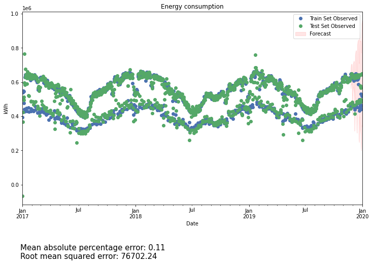

# Helsinki Energy Demand Prediction

  

This project aims to predict aggregate electricity demand from a selected list of locations in the City of Helsinki by using the 3 leading methods: a classical Box-Jenkins model, a Deep Learning Neural Network, and a Facebook Prophet model.

The project itself is divided into 2 parts. The first one is about predicting *daily* electricity demand using the first 2 models. The second part use Facebook Prophet to do forecasting on *hourly* demand.

The data is fetched from the Nuuka open API, courtesy of Avoindata.fi. You can visit our Medium article [here](https://towardsdatascience.com/end-to-end-time-series-analysis-and-forecasting-a-trio-of-sarimax-lstm-and-prophet-part-1-306367e57db8), or the project website [here](https://quan-possible.github.io/energy-demand-prediction).

Authors: [Bruce Nguyen](https://github.com/quan-possible) and [Son Le](https://github.com/SonAlexLe).

### [Daily data analysis with SARIMAX and LSTM](https://quan-possible.github.io/energy-demand-prediction/daily)

### [Hourly data analysis with Prophet](https://quan-possible.github.io/energy-demand-prediction/hourly)
